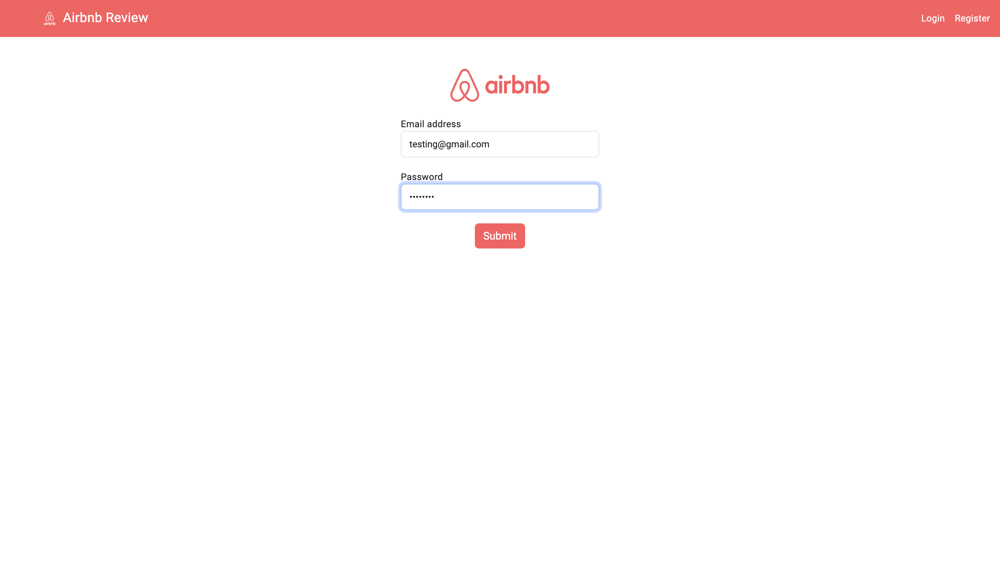
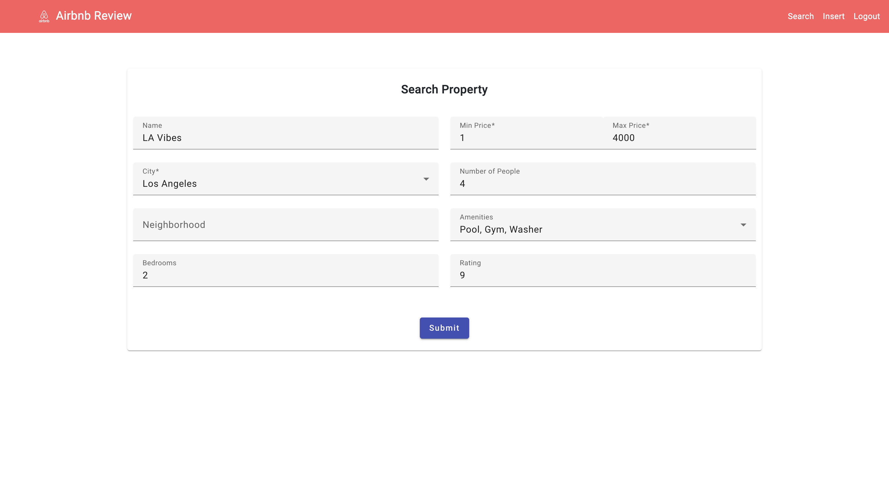

# Airbnb Review System

This is a project implemented for the DSCI 551 (Foundations of Data Management) course at University of Southern California. It is a distributed database system to efficiently manage extensive Airbnb property listings and reviews dataset. This system provides robust functionalities, including Create, Read, Update, and Delete (CRUD) capabilities for reviews and advanced search options based on location, price, and amenities.

This project utilizes a powerful technological stack comprising Angular, Flask, and PostgreSQL. These technologies were chosen for their ability to handle large volumes of data with high write throughput and scale horizontally, ensuring a responsive and scalable system suitable for database managers and end-users.

Leveraging a comprehensive dataset from [Inside Airbnb](https://insideairbnb.com/get-the-data), which includes detailed listings and review data, facilitates the dynamic management of data through a distributed architecture. This allows for detailed insights and an enhanced user experience, facilitating better decision-making and engagement with Airbnb properties.

The project has a user-friendly interface for database managers and end-users, ensuring data consistency across multiple database nodes. 

## Directory Structure
The directory structure provided outlines a well-organized project setup for an Airbnb application using Angular for the frontend and Flask with PostgreSQL for the backend. Here’s a breakdown of the main components within this structure:

### Backend folder
Contains all backend-related files, including Python scripts and environment configurations.

[`app.py`](Backend/app.py)

Consists of several functions and routes:

**1. User authentication:**
User authentication system with routes for user registration (`/register`), login (`/login`), and user loading from a dummy users list.

**2. Property Listings and Reviews:**
- Endpoints for adding (`/addReview`), updating (`/updateReview`), and deleting (`/deleteReview`) reviews using dynamic SQL queries based on input parameters like city and property details.

- A search feature (`/search`) that allows filtering listings by multiple criteria such as price range, number of bedrooms, amenities, etc., dynamically building SQL queries based on user inputs.
- Functions to insert and remove reviews and property data, ensuring data integrity and appropriate error handling.

**3. Additional Utilities:**
- Routes for fetching city names from the database (`/getCities`), and inserting new properties into the database (`/insert`).
- Implements CSV file upload functionality (`/upload_csv`) to process and store data from CSV files into the database, grouped by city.
- A utility route (`/removeAllReviews`) to remove all reviews associated with a given listing.

**4. Schema Management:**
Functions to create new city databases and schemas dynamically based on the city name, facilitating the expansion of the application to new locations without manual database configuration.

[`createDBs.py`](Backend/createDBs.py)

Implemented a comprehensive data management system using Python, PostgreSQL, and libraries such as Pandas and NumPy. The code consists of several functions designed to manage databases and schemas, handle data insertion, and ensure the integrity and scalability of the system.

Key implementations include:

**Database and Schema Management:**
Establish a new PostgreSQL database with the starting letter of a city if it doesn't already exist, ensuring that each city's data is isolated and managed independently. Creation of city-specific schemas within each alphabetic database, allowing for organized data management and querying.

**Data Insertion and Table Setup:**
Process and insert data from CSV files into the appropriate tables within the city schemas. This includes handling specific data types and potential conflicts during insertion to maintain data integrity. Define the structure of the tables, such as `listings` and `reviews`, ensuring each table is prepared to store data with the correct constraints and relationships. Create a `listings_reviews` bridge table acting as a bridge between the `listings` and `reviews` tables.

**Dynamic City Data Management:**
Manage a centralized table that tracks the databases associated with each city, supporting dynamic access and scalability.

[`filterData.py`](Backend/filterData.py)

A Python script designed to streamline the processing and organization of Airbnb data files. This script ensures that the data is prepared in a consistent and clean format suitable for further analysis and database insertion. 

Key implementations include:

**Data Filtering and Cleaning:**
For the `listings.csv` files, the script filters the necessary columns and performs data cleaning operations such as removing currency symbols from price values and converting them to float for numerical analysis.  It also checks that the 'id' column contains only numeric values.

**Character Encoding Validation:**
To ensure compatibility and avoid encoding errors, validate that all data entries can be encoded in ASCII format. This step is applied across all columns of the dataframes for both `listings.csv` and `reviews.csv`.

**Data Saving:**
After processing, the cleaned and validated data is saved back to CSV files in the designated destination directory for each city. 
This ensures that the processed data is ready for import into the database system without further modifications.

## src folder
[`app`](src/app)

Contains Angular components and services. This is where most of the application logic resides, including views and data handling services.

## Steps to run the project
1. Clone the repository by running `git clone https://github.com/Aagam1090/Airbnb.git`
2. Download a part of the [Airbnb dataset](https://drive.google.com/drive/folders/1pPbjFzAveZtaRjReYcXDvaWSmxy2023r?usp=sharing) used by us and save it in the root directory of the cloned repository.
3. Open the project in the editor of your choice (we used VSCode) and start pgAdmin.
4. Open the createDBs.py file and change the host, user, and password according to your Postgres setup in main. Similarly, open the app.py file and change the same in the get_db_connection() function.
5. Run the following commands (It will take time):
   - `cd Backend`
   - `pip install -r requirements.txt`
   - `python3 filterData.py`
   - `python3 createDBs.py`
6. Open a new terminal and run the following commands:
   - `npm i`
   - `ng serve`
7. Open a browser and search `http://localhost:4200/`

   Hopefully, everything starts without any errors!

## Screenshots

**Landing Page**

**Register**

**Login**

**Insert**

**Search**

**Search Result**

**Reviews**

**Updating Review**

**After Updating**

**Admin Bulk Insert**
